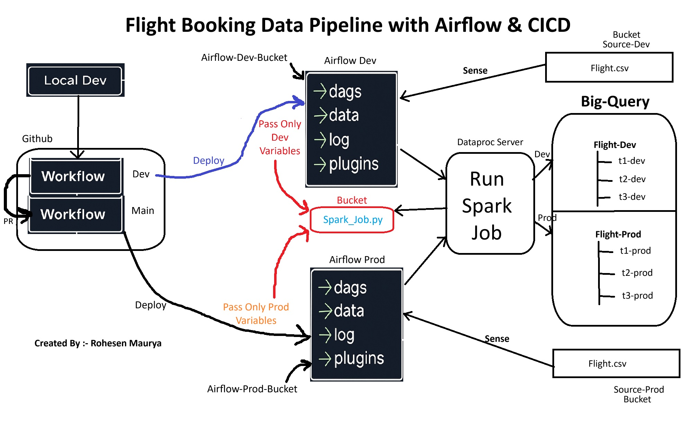

# ✈️ Flight Booking Data Pipeline with Airflow & CICD

## 📌 Overview

This project implements an **end-to-end data engineering pipeline** to process **flight booking data** and generate **business insights** using:

* **Apache Airflow** for orchestration
* **PySpark on Dataproc Serverless** for distributed transformations
* **BigQuery** for analytics-ready storage
* **GitHub Actions** for CI/CD deployment to **Dev** and **Prod** environments
* **Google Cloud Storage (GCS)** for staging input data & Spark scripts

The pipeline reads raw booking data from GCS, processes it in PySpark to create enriched datasets and aggregated insights, then loads the results into BigQuery for downstream analysis.



---

## 🛠 Tech Stack

* **Orchestration**: Apache Airflow (Google Cloud Composer)
* **Processing**: PySpark on Dataproc Serverless
* **Data Storage**:

  * Staging: Google Cloud Storage (GCS)
  * Warehouse: BigQuery
* **CI/CD**: GitHub Actions
* **Version Control**: Git & GitHub

---

## 📂 Project Structure

```
Flight_Booking_Data_Pipeline_CICD/
│
├── airflow_job/                     # Airflow DAG files
│   └── airflow_job.py
│
├── spark_job/                        # PySpark transformation scripts
│   └── spark_transformation_job.py
│
├── variables/                        # Airflow variables for different environments
│   ├── dev/variables.json
│   └── prod/variables.json
│
├── .github/workflows/                # GitHub Actions workflows
│   └── ci-cd.yaml
│
└── README.md
```

---

## ⚙️ Pipeline Workflow

### 1. **Data Ingestion**

* Raw flight booking CSV files are uploaded to GCS (`source-{env}/flight_booking.csv`).

### 2. **Orchestration with Airflow**

* **GCSObjectExistenceSensor** waits for the source file to arrive.
* **DataprocCreateBatchOperator** triggers a PySpark job on Dataproc Serverless.

### 3. **Transformation in PySpark**

* Add derived columns:

  * `is_weekend` (flag if flight is on Sat/Sun)
  * `lead_time_category` (Last-Minute, Short-Term, Long-Term)
  * `booking_success_rate`
* Generate **aggregated insights**:

  * By route (total bookings, avg flight duration, avg stay length)
  * By booking origin (total bookings, success rate, avg purchase lead)

### 4. **Load to BigQuery**

* Transformed datasets and insights are written to **BigQuery tables** in the respective dataset (`flight_data_dev` or `flight_data_prod`).

### 5. **CI/CD with GitHub Actions**

* **Push to `dev` branch** → Deploys DAG & Spark job to Airflow-DEV, uploads Airflow Variables.
* **Push to `main` branch** → Deploys to Airflow-PROD.

---

## 🚀 Deployment Process

### **Development Environment**

1. Push changes to `dev` branch.
2. GitHub Actions:

   * Uploads variables to Composer DEV bucket.
   * Deploys Airflow DAG to DEV environment.
   * Uploads Spark job to GCS.

### **Production Environment**

1. Merge `dev` → `main`.
2. GitHub Actions:

   * Uploads variables to Composer PROD bucket.
   * Deploys Airflow DAG to PROD environment.
   * Uploads Spark job to GCS.

---

## 📊 Example Business Insights Generated

* **Top Routes by Booking Volume**
* **Average Stay Length by Route**
* **Booking Success Rate by Origin**
* **Lead Time Patterns for Different Customer Segments**

---

## 🔑 Airflow Variables Example

**`variables/dev/variables.json`**

```json
{
  "env": "dev",
  "gcs_bucket": "airflow-projetcs-rohesen",
  "bq_project": "horizontal-data-464415-v6",
  "bq_dataset": "flight_data_dev",
  "tables": {
    "transformed_table": "transformed_flight_data_dev",
    "route_insights_table": "route_insights_dev",
    "origin_insights_table": "origin_insights_dev"
  }
}
```

---

## 🖼 Architecture Diagram

```
       ┌─────────────┐
       │    GitHub    │
       └──────┬───────┘
              │ (Push to dev/main)
              ▼
     ┌─────────────────┐
     │ GitHub Actions   │
     └──────┬───────────┘
            │ Upload DAG, Spark job, Variables
            ▼
     ┌───────────────────────┐
     │   Cloud Composer       │
     │ (Airflow DAG Trigger)  │
     └─────────┬──────────────┘
               │ Trigger PySpark job
               ▼
     ┌─────────────────────────┐
     │ Dataproc Serverless      │
     │ (PySpark Transformation) │
     └──────────┬───────────────┘
                │ Write Results
                ▼
     ┌─────────────────────────┐
     │        BigQuery          │
     │  (Analytics & Insights)  │
     └─────────────────────────┘
```

---

## 📌 Key Learnings

* Setting up **Dataproc Serverless** with Airflow orchestration.
* Designing **idempotent PySpark jobs** for reliable re-runs.
* Automating deployments with **GitHub Actions & GCP CLI**.
* Managing environment-specific configurations with **Airflow Variables**.
